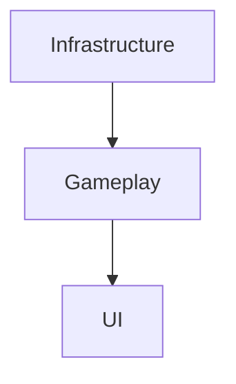
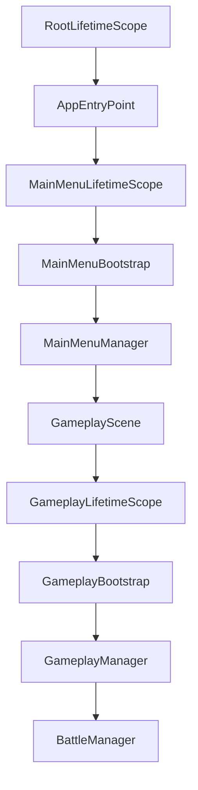
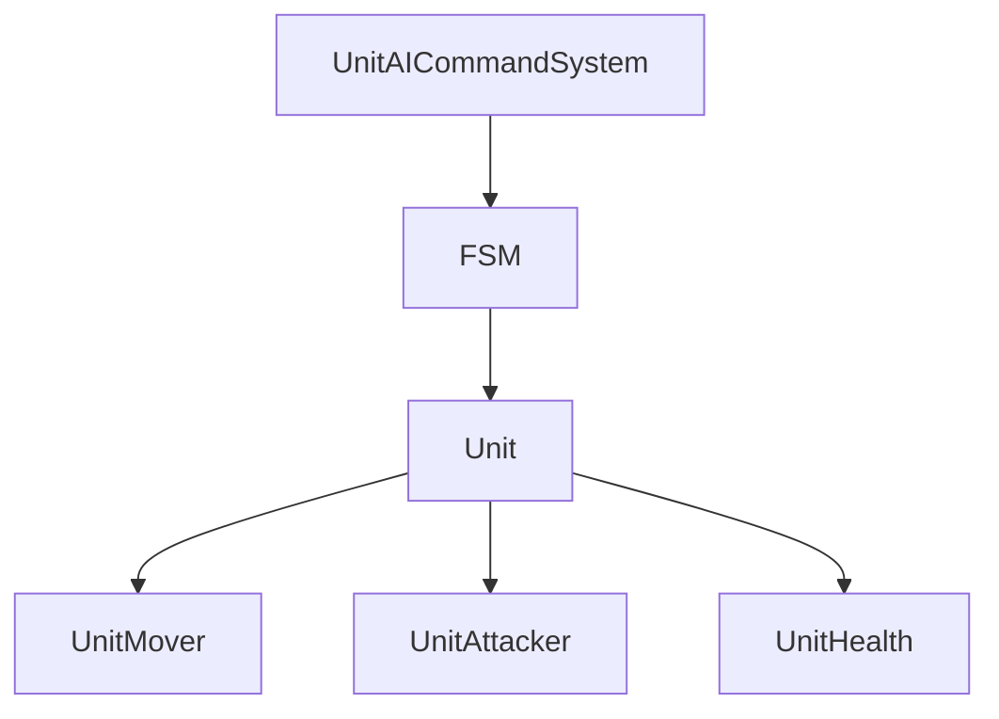
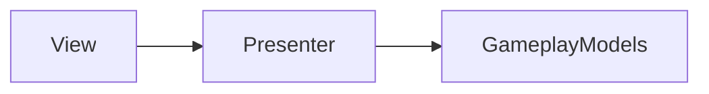

# Архитектура проекта

## Цели архитектуры

Основные цели проекта:

- масштабируемость;
- тестируемость;
- прозрачность поведения системы;
- минимизация связности;
- повторное использование кода;
- высокая производительность.

Проект представляет собой демонстрацию архитектурных решений и не является production-ready игрой.

---

# Общая архитектура

Архитектурно приложение разделено на три основных слоя:



---

# Infrastructure Layer

Слой инфраструктуры полностью независим от бизнес-логики.

В него входят:

- EventBus
- SceneManager
- AudioManager
- EconomyManager

---

## EventBus

Типобезопасная шина событий.

Используется для:

- связи UI и Gameplay;
- связи сервисов;
- связи сцен;
- оркестрации приложения.

Преимущества:

- слабая связность;
- высокая тестируемость;
- отсутствие прямых зависимостей между слоями.

---

## SceneManager

Отвечает за:

- асинхронную загрузку сцен;
- экран загрузки;
- отображение прогресса;
- плавные переходы между сценами.

---

## AudioManager

Отвечает за:

- фоновую музыку;
- игровые звуки;
- централизованное управление аудио.

---

## EconomyManager

Предоставляет единый источник данных для экономики игры.

Позволяет:

- хранить ресурсы;
- отображать баланс игрока;
- использовать экономику между сценами.

---

# Поток приложения



---

# Dependency Injection

В проекте используется VContainer.

Причины выбора:

- высокая производительность;
- отсутствие рефлексии в рантайме;
- хорошая интеграция с Unity;
- поддержка Scene Scope.

---

## LifetimeScopes

Используются два уровня контейнеров:

### RootLifetimeScope

Глобальные сервисы:

- EventBus
- AudioManager
- EconomyManager
- SceneManager

---

### Scene LifetimeScopes

Сервисы конкретной сцены:

- GameplayManager
- BattleManager
- UI Presenters
- Конфигурации

---

# Gameplay Layer

Основной слой бизнес-логики.

Содержит:

- GameplayManager
- BattleManager
- Unit System
- Formation System

---

# GameplayManager

Глобальный оркестратор игровой сцены.

Отвечает за:

- старт игры;
- паузу;
- завершение игры;
- загрузку сцен.

---

# BattleManager

Центральный оркестратор боевой сессии.

Хранит:

- список защитников;
- список захватчиков;
- мощность армий;
- состояние боя.

---

## Обязанности

- создание армий;
- спавн юнитов;
- удаление погибших юнитов;
- завершение боя;
- поиск ближайших целей.

---

# Архитектура юнитов

Система разделена на два уровня:

- логика;
- исполнители.



---

# Strategic Layer

## UnitAICommandSystem

Отвечает на вопрос:

> Что делать?

Например:

- стоять;
- двигаться;
- искать цель;
- атаковать.

Реализует интерфейс:

```csharp
ICommandSystem
```

Благодаря этому легко заменить AI на управление игроком.

---

# Tactical Layer

## FSM

Отвечает на вопрос:

> Как делать?

Каждое состояние является отдельным Pure C# классом.

Примеры состояний:

- IdleState
- MoveState
- AttackState
- DeathState

---

# Исполнители

Исполнители не принимают решений.

Они лишь реализуют поведение.

---

## UnitMover

Отвечает только за движение.

---

## UnitAttacker

Отвечает только за нанесение урона.

---

## UnitHealth

Отвечает только за здоровье.

Хранит состояние HP.

Сообщает о смерти через событие.

---

# Unit

Единственный MonoBehaviour.

Используется как Facade между:

- логикой;
- исполнителями;
- Unity API.

Обязанности:

- хранение состояния;
- предоставление данных;
- делегирование действий.

---

# Конфигурации

В проекте активно используются ScriptableObject.

Основные конфигурации:

- UnitConfig
- FormationData
- ModifiersProvider

---

# Система модификаторов

Позволяет изменять характеристики без изменения кода.

Например:

- здоровье;
- скорость;
- урон;
- скорость атаки.

---

# UI Layer

Используется классический Game MVP.



---

## Views

Тонкие MonoBehaviour-компоненты.

Отвечают только за:

- отображение;
- анимации.

---

## Presenters

Pure C# классы.

Отвечают за:

- подписки;
- обновление UI;
- преобразование данных.

---

# DoTween

Используется для:

- анимации UI;
- числовых счётчиков;
- progress bar;
- последовательностей анимаций.

Все анимации привязаны через:

```csharp
SetLink()
```

Для предотвращения утечек и NullReferenceException при удалении view.

---

# Editor Tooling

Проект содержит набор инструментов редактора.

---

## FormationEditorWindow

Позволяет создавать формации без написания кода.

Используется геймдизайнерами.

---

## FormationDataSOInspector

Обзор/редактирование конфигураций формаций.

---

## UnitConfigSOEditor

Realtime отображение итоговых характеристик юнитов.

Позволяет быстро балансировать игру.

---

# Производительность

Стресс-тестирование показало:

- До 1000 одновременно активных юнитов
- ~30 FPS на бюджетном Android устройстве

---

## Основной Bottleneck

Unity Animator.

---

## Возможные улучшения

- GPU Animation
- Animation Baking
- ECS
- Job System
- Burst

---

# Возможность расширения

Текущая архитектура позволяет без значительных изменений внедрить:

- Addressables
- AssetBundles
- UniRx / R3
- ECS
- Multiplayer

---

# Заключение

Проект демонстрирует подход к разработке масштабируемых Unity-приложений с использованием:

- Dependency Injection
- Event Driven Architecture
- FSM
- MVP
- ScriptableObject-конфигураций
- Editor Tooling

При сохранении высокой читаемости и тестируемости кода.