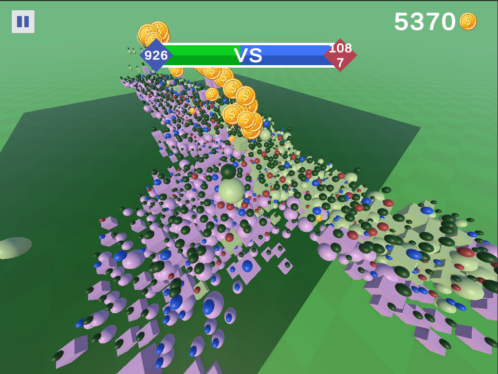
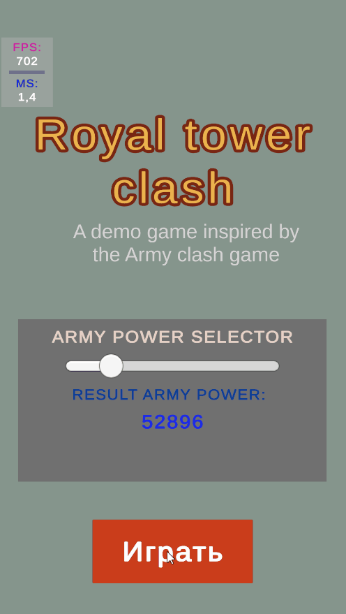
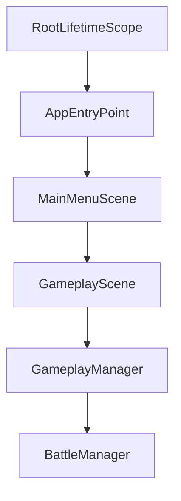
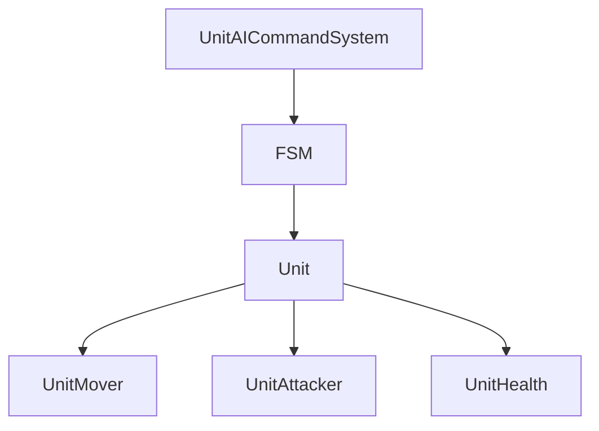
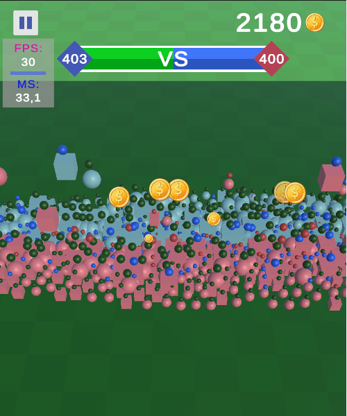
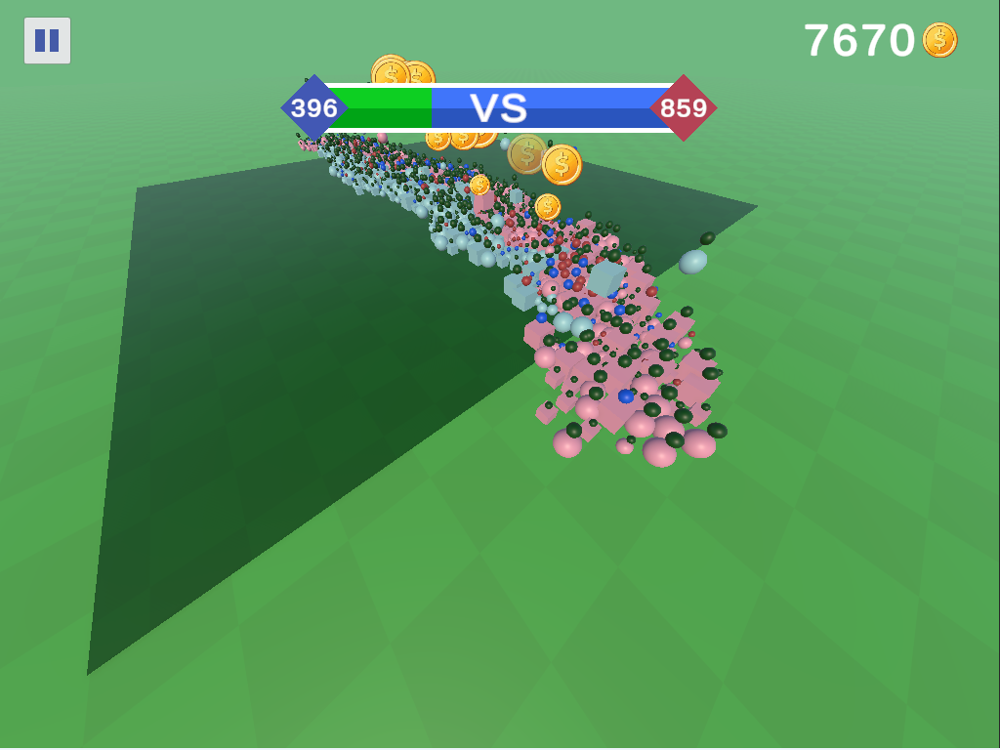
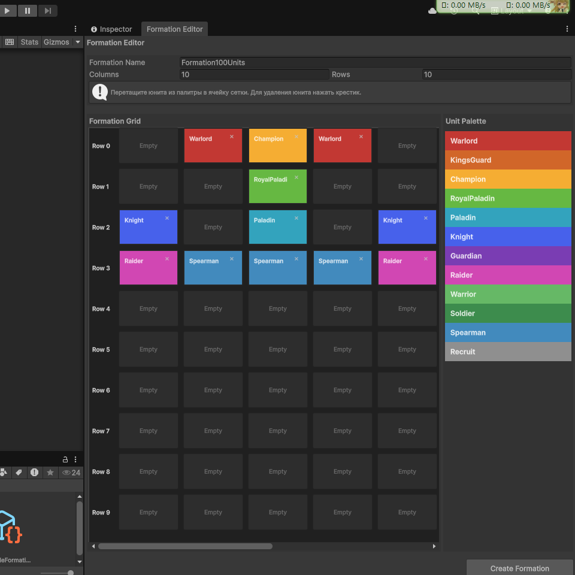
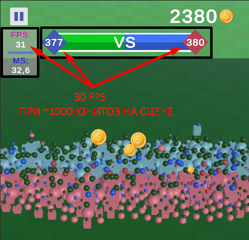

# Test Army Clash Game



Демонстрационный Unity-проект автобаттлера, созданный как showcase современной архитектуры игрового приложения.

Проект демонстрирует:

- Clean Architecture
- Dependency Injection (VContainer)
- Event-Driven Architecture
- MVP UI
- FSM AI
- Data Driven Design
- ScriptableObject-конфигурации
- Editor Tooling для геймдизайнеров
- Высокую производительность при большом количестве юнитов

---

## Демонстрация

### Бой



### Интерфейс


---

## Технологии

| Технология | Назначение |
|------------|------------|
| Unity | Игровой движок |
| VContainer | Dependency Injection |
| UniTask | Асинхронность |
| DoTween | Анимации |
| ScriptableObject | Конфигурация данных |
| EventBus | Слабая связность систем |

---

## Особенности проекта

### Слабосвязная архитектура

Слои приложения изолированы друг от друга и взаимодействуют через типобезопасную EventBus-систему.

### Чистая игровая логика

Основная игровая логика реализована в Pure C# классах с минимальной зависимостью от Unity API.

### Расширяемая архитектура юнитов

Логика принятия решений, состояния и реализация поведения разделены на отдельные слои.

### Editor Tooling

Проект содержит собственные инструменты редактора для:

- создания формаций;
- настройки конфигураций;
- просмотра итоговых статов юнитов.

---

## Архитектура приложения



---

## Архитектура юнитов



---

## Скриншоты

### Игровой процесс



### Массовое сражение



### Редактор формаций



### Производительность



---

## Производительность

Результаты стресс-тестирования:

- До 1000 одновременно активных юнитов
- Около 30 FPS на low-end Android устройстве

Основной bottleneck:

- Unity Animator

Потенциальные направления дальнейшей оптимизации:

- GPU Animation
- Animation Baking
- ECS
- Job System

---

## Структура проекта

```text
Runtime
├── DI
├── Infrastructure
├── Gameplay
├── MainMenu
├── GameEvents

Editor
├── FormationEditorWindow
├── FormationDataSOInspector
└── UnitConfigSOEditor
```

---

## Подробная документация

Подробное описание архитектуры находится в файле:

👉 [ARCHITECTURE.md](ARCHITECTURE.md)

---

## Запуск проекта

Открыть сцену:

Scenes/EntryPointScene

и нажать Play.

---

## Цель проекта

Проект создан как демонстрация подходов к построению масштабируемой, тестируемой и производительной архитектуры мобильной игры на Unity.